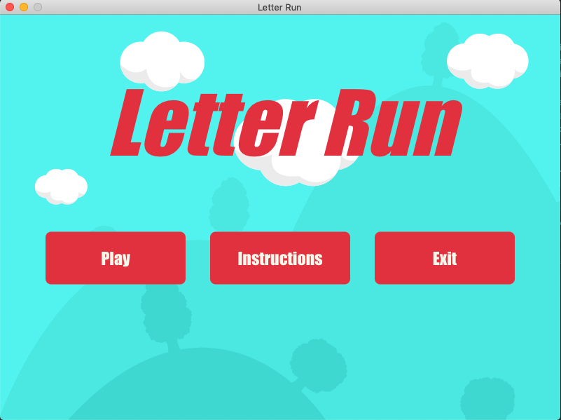
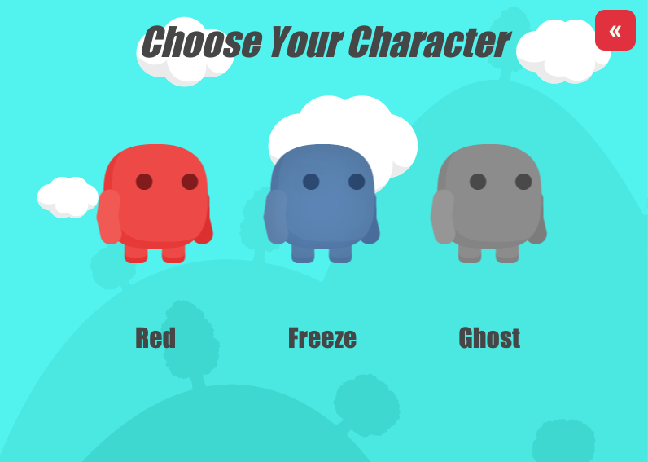
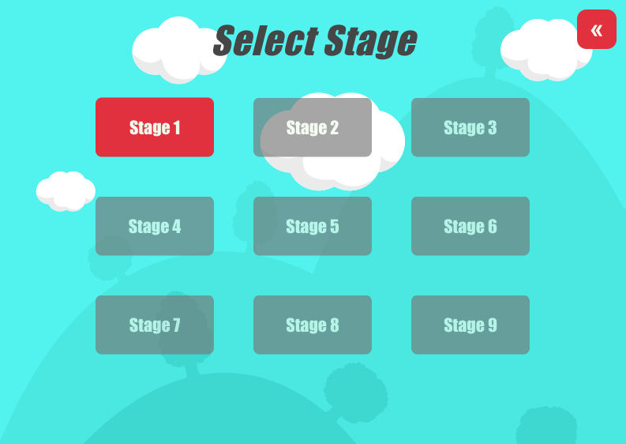

# Letter Run
 
Letter Run is a 2d platformer game developed as a desktop application using phaser.js
 
 

 

 

 
 
 
 ## Play Game
 
 Click the link below, and choose "Letter Run Online"
 
 https://forche.itch.io/letter-run-online
 
 ## Download Game

In order to download the game as a desktop application, please follow the link below. 
 
https://forche.itch.io/letter-run

* Click Letter Run for Desktop

 
 
* Download the application for your OS (Mac or Windows)
* Extract the zipped folder
* Click the executable to play the game   
 
 
 ## Development work flow

* Start with the master branch.

* Create a new branch – Do this for each new task/feature, Branch names should reflect the task/feature that is being developed.

* Update, add, commit, and push changes- Make sure to push changes when one step is done, this will help us to keep track of our
                                      changes and find a way to recover if something goes wrong. 
                                      
* Push feature branch to remote – Feature branch is updated in the central repository for other team members to view changes.

* Resolve feedback – Have someone else review your code before merging.

Merge your pull request – Check for any conflicts and add the code to the master branch.

## COMMIT MESSAGE FORMAT

Commit Message should be informative for what is changed/removed/added. Example: “Added character select screen functionality” or “Changed settings page instructions” 

## Packacking app for distribution

* Make sure to install the electron-packager using npm install command.
~~~
npm install electron-packager --save-dev
~~~

* After the installation, the syntax for running electron-packager is listed below.
~~~
electron-packager <sourcedir> --platform=<platform> --arch=<arch> [optional flags...]
~~~

* Example to package LetterRun for Windows OS
~~~
electron-packager <sourcedir> --overwrite --platform=win32 --arch=ia32 --prune=true --out=<desired directory name>
~~~

* Example to package LetterRun for MacOS
~~~
electron-packager <sourcedir> --overwrite --platform=darwin --arch=x64 --prune=true --out=<desired directory name>
~~~

* To include custom icon, add following flag to your command
~~~
--icon=<your directory for icon>/<your icon file>
~~~

* For more details and flags to use...
~~~
electron-packager -h 
~~~

* Visit https://github.com/electron-userland/electron-packager for more details

 ## Assets
 https://bayat.itch.io/platform-game-assets
